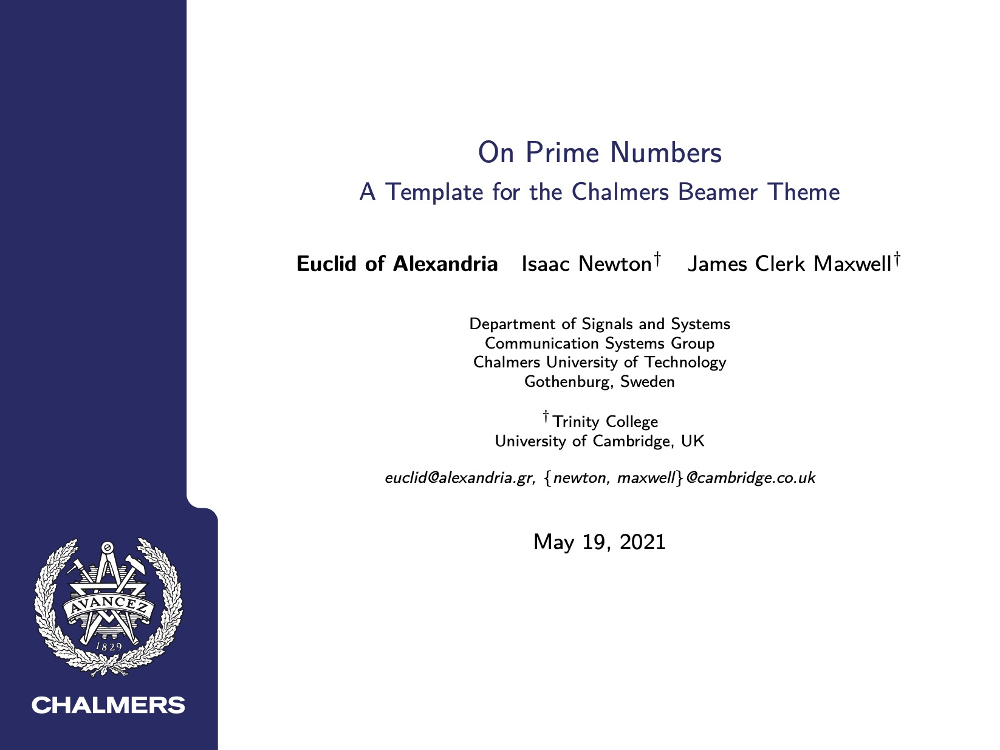
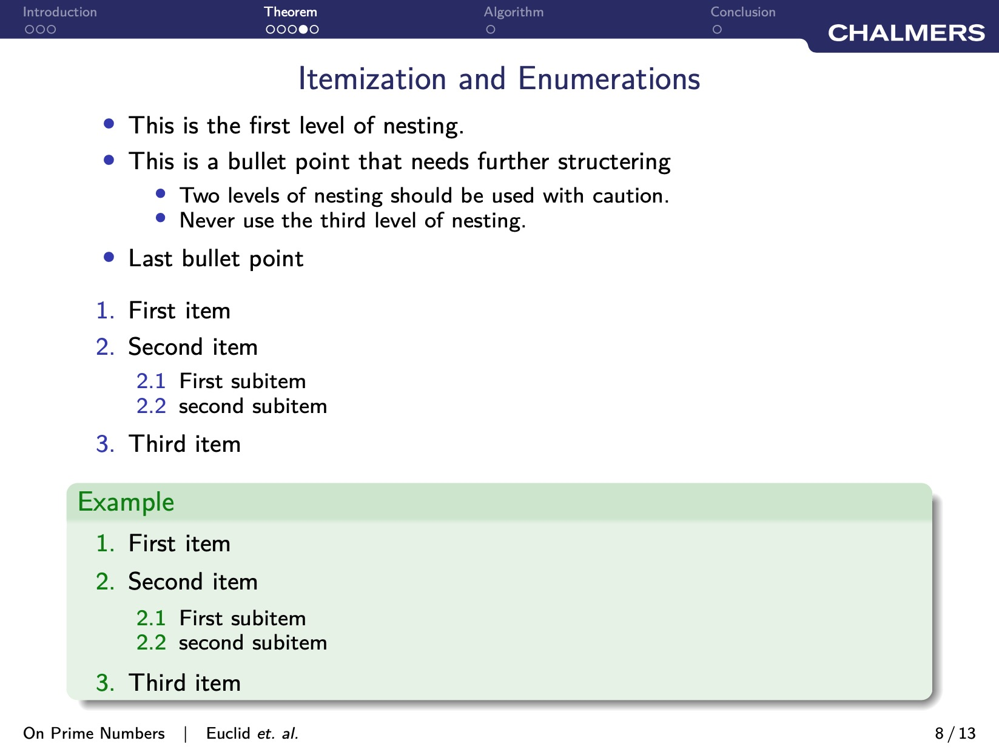

# chalmers-beamer
A [LaTeX Beamer](https://ctan.org/pkg/beamer?lang=en) theme for students and researchers at [Chalmers University of Technology](https://www.chalmers.se/). 

# Example
The template and an example can be found in the folder `template`. After compiling the `.tex` file, the resulting `.pdf` should look something like this: 

 

 

# Installation
The simplest way is to put the `.sty` file and figures in the same folder as your main `.tex` file. 
Alternatively, you can put these files in the folder `$TEXMFHOME/tex/latex`, where the value of `$TEXMFHOME` can be found via the command `kpsewhich -var-value TEXMFHOME`. 

